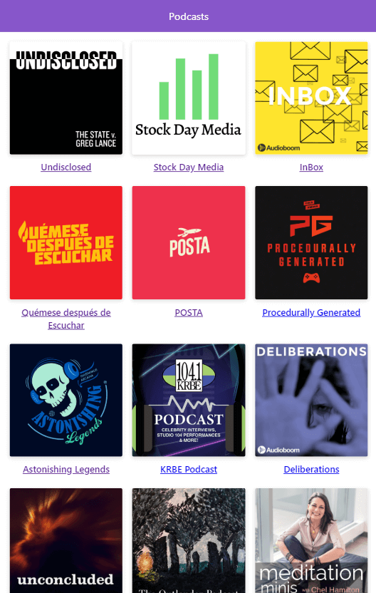

# App de Podcasts

App de podcast integrada con la API de AudioBoom para aprender Next.js

## Pasos para su uso

Requiere Node.js 10

* `npm install` para instalar dependencias
* `npm run dev` paa el entorno de desarrollo
* `npm run buld && npm run start` para produccción

## Licencia

MIT